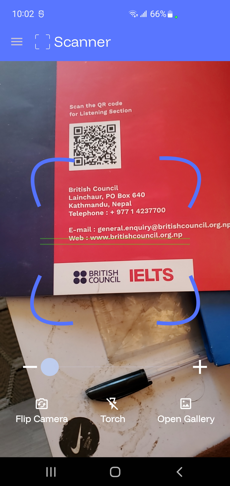
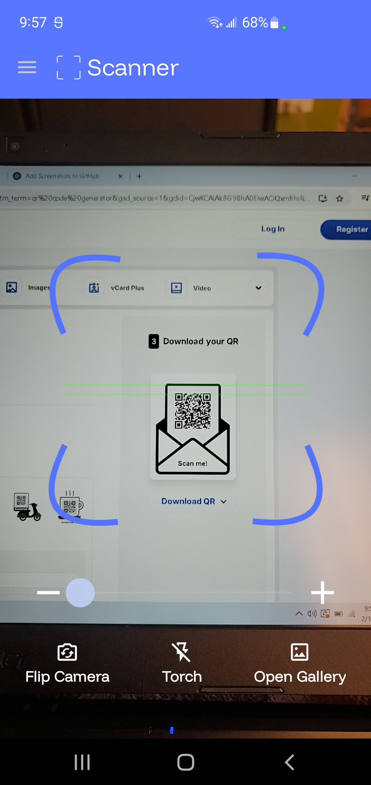
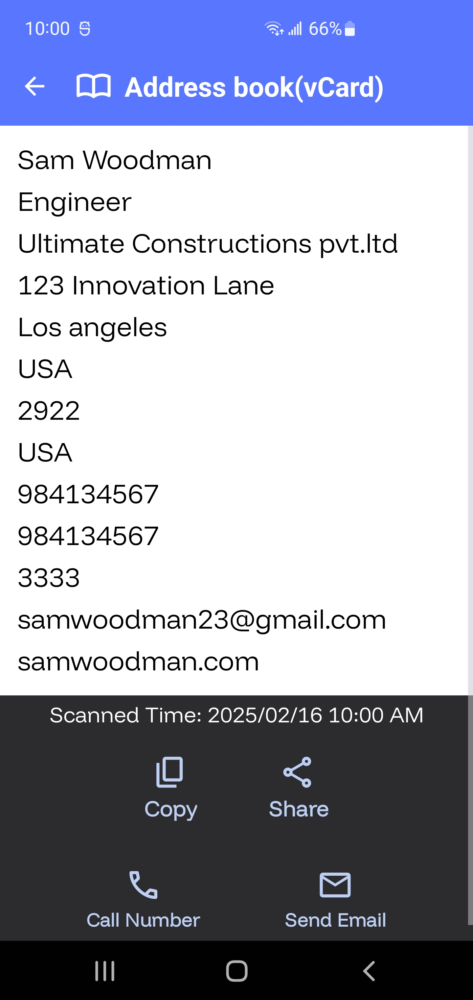
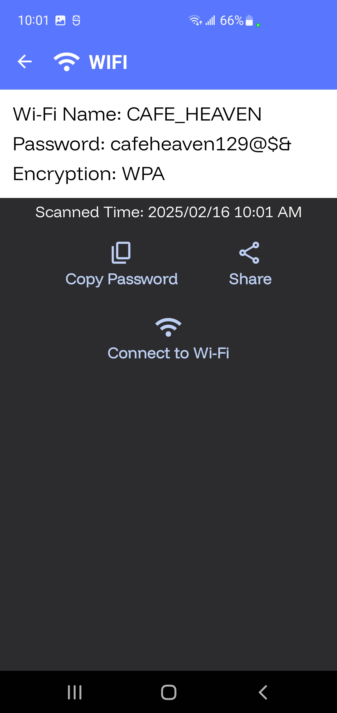
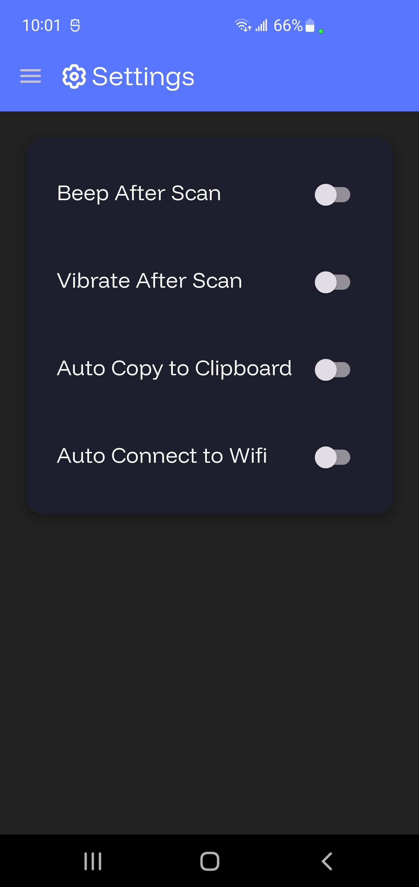
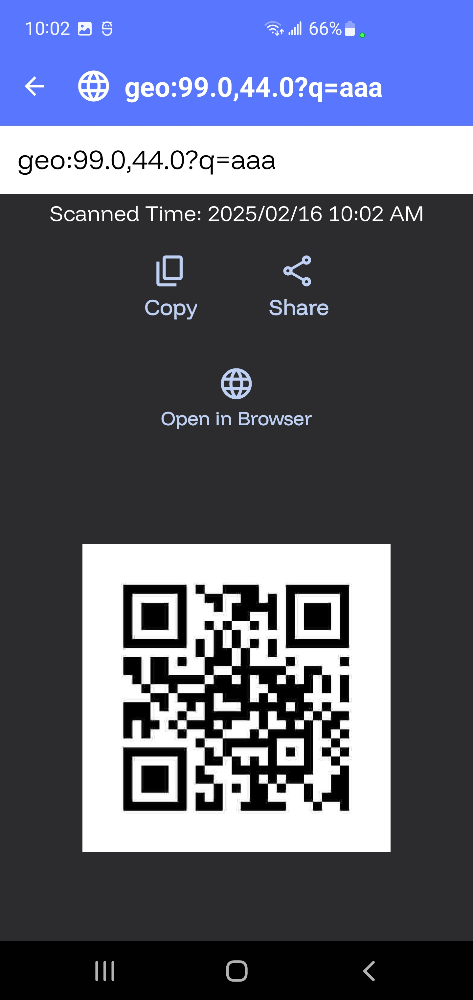

QR Code Scanner Application
Overview
This repository contains the source code for a QR Code Scanner Android application. The app allows users to scan QR codes and barcodes, view the scanned results, and manage their scan history. It includes features such as flashlight control, camera zoom, vibration feedback, and the ability to save scan results to a local database. The app also supports scanning QR codes from images in the gallery and provides options to share, copy, or save the scan results.

Features
QR Code and Barcode Scanning: Scan QR codes and barcodes using the device's camera.

Flashlight Control: Toggle the flashlight on/off for better scanning in low-light conditions.

Camera Zoom: Adjust the camera zoom level for better focus on the QR code.

Vibration Feedback: Get haptic feedback when a QR code is successfully scanned.

Gallery Scanning: Scan QR codes from images stored in the device's gallery.

Scan History: View and manage a history of scanned QR codes.

Result Sharing: Share scan results via other apps (e.g., messaging, email).

Auto-Copy to Clipboard: Automatically copy scan results to the clipboard.

Wi-Fi Auto-Connect: Automatically connect to Wi-Fi networks using scanned QR codes.

Customizable Settings: Configure app settings such as vibration, sound, and auto-copy behavior.

Screenshots
(You can add screenshots of the app here if available.)

Installation
Clone the repository:

bash
Copy
git clone https://github.com/your-username/qr-code-scanner.git
Open the project in Android Studio.

Build and run the app on an Android device or emulator.

Usage
Scanning QR Codes:

Open the app and point the camera at a QR code.

The app will automatically detect and scan the QR code.

Once scanned, the result will be displayed on the screen.

Viewing Scan History:

Navigate to the "History" section to view previously scanned QR codes.

Tap on any entry to view detailed information.

Sharing Results:

After scanning a QR code, use the share button to share the result via other apps.

Settings:

Access the settings menu to customize app behavior, such as enabling/disabling vibration, sound, and auto-copy to clipboard.

Dependencies
The app uses the following libraries:

ZXing: For QR code and barcode scanning.

Room: For local database storage of scan history.

Glide: For image loading and caching.

Lottie: For animations.

Paging: For efficient loading of scan history.

Permissions
The app requires the following permissions:

Camera: To scan QR codes using the device's camera.

Vibrate: To provide haptic feedback when a QR code is scanned.

Internet: For Wi-Fi auto-connect functionality.

Access Wi-Fi State: To manage Wi-Fi connections.

Change Wi-Fi State: To connect to Wi-Fi networks.

Contributing
Contributions are welcome! If you find any issues or have suggestions for improvements, please open an issue or submit a pull request.

License
This project is licensed under the MIT License. See the LICENSE file for details.

Acknowledgments
ZXing Team: For providing the barcode scanning library.

Android Open Source Project: For the Room database and other Android libraries.

## Screenshots

### Screenshot 1

|  |  |
|  |  |

### Screenshot 

