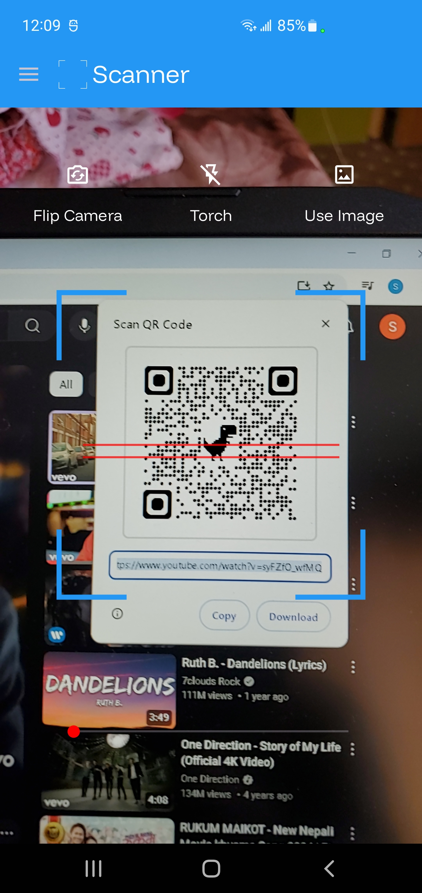
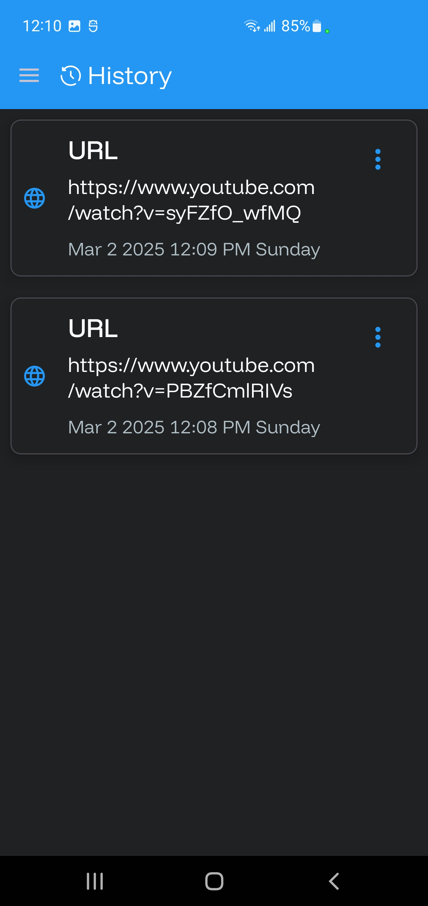
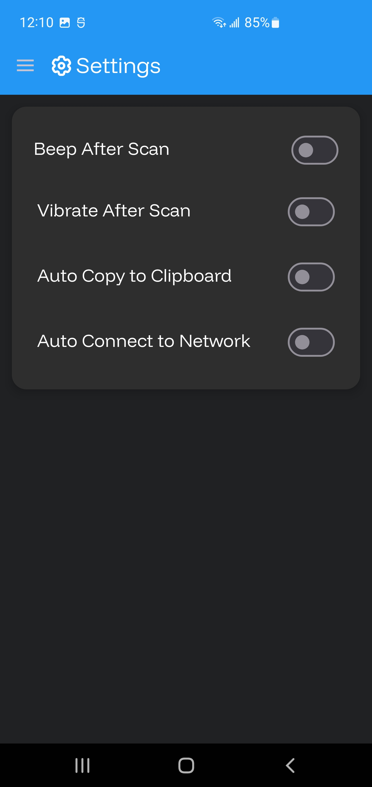
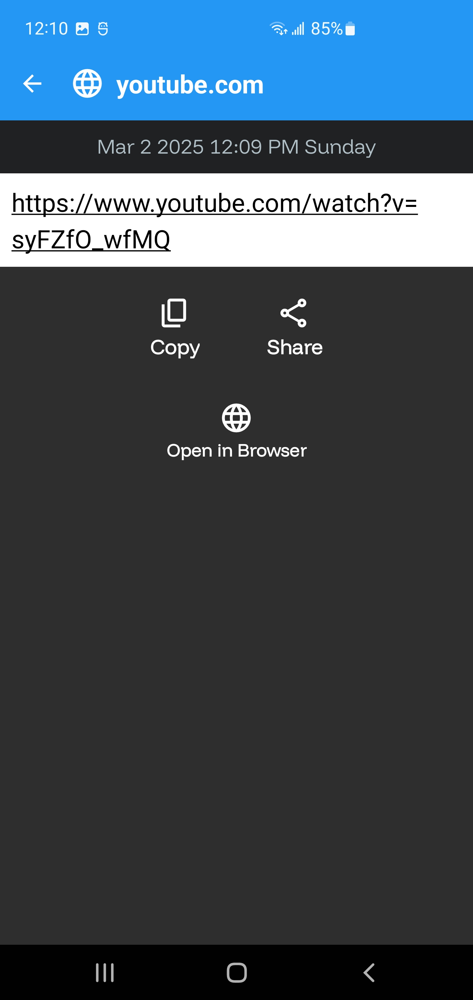

# QR Code Scanner Android App

## Description

This repository contains the source code for a **QR Code Scanner Android Application** built using Kotlin. The app is designed to provide a seamless and feature-rich experience for scanning QR codes and barcodes. It includes advanced functionalities such as flashlight control, camera zoom, vibration feedback, and the ability to scan QR codes from images stored in the gallery. The app also maintains a history of scanned QR codes, allowing users to view, manage, and share their scan results easily.

### Key Features:
- **QR Code and Barcode Scanning**: Scan any QR code or barcode using the device's camera.
- **Flashlight Support**: Toggle the flashlight on/off for better scanning in low-light environments.
- **Camera Zoom**: Adjust the camera zoom level for improved focus on the QR code.
- **Vibration Feedback**: Get haptic feedback when a QR code is successfully scanned.
- **Gallery Scanning**: Scan QR codes from images stored in the device's gallery.
- **Scan History**: View and manage a history of all scanned QR codes.
- **Result Sharing**: Share scan results via other apps (e.g., messaging, email).
- **Auto-Copy to Clipboard**: Automatically copy scan results to the clipboard for quick access.
- **Wi-Fi Auto-Connect**: Automatically connect to Wi-Fi networks using scanned QR codes.
- **Customizable Settings**: Configure app behavior, such as enabling/disabling vibration, sound, and auto-copy to clipboard.

### Use Cases:
- **Personal Use**: Quickly scan QR codes for URLs, Wi-Fi credentials, contact information, and more.
- **Business Use**: Manage and track scanned QR codes for inventory, marketing, or event management.
- **Educational Use**: Teach students about QR code technology and its applications.

### Technologies Used:
- **Kotlin**: The primary programming language for the app.
- **ZXing**: A powerful library for QR code and barcode scanning.
- **Room Database**: For storing and managing scan history locally.
- **Glide**: For efficient image loading and caching.
- **Lottie**: For smooth and engaging animations.
- **Paging Library**: For efficient loading and display of scan history.

### Permissions:
- **Camera**: Required for scanning QR codes.
- **Vibrate**: For haptic feedback on successful scans.
- **Internet**: For Wi-Fi auto-connect functionality.
- **Access Wi-Fi State**: To check and manage Wi-Fi connections.
- **Change Wi-Fi State**: To connect to Wi-Fi networks.

---

## Why This Project?

This project is a great example of how to build a modern Android app with advanced features like QR code scanning, database management, and user-friendly UI/UX. It demonstrates the use of popular libraries like ZXing, Room, and Glide, making it a valuable resource for developers looking to learn or improve their Android development skills.

---

## How to Use

1. Clone the repository:
   ```bash
   git clone https://github.com/your-username/qr-code-scanner.git

## Screenshots

### Screenshot 1


|  |  |
| 